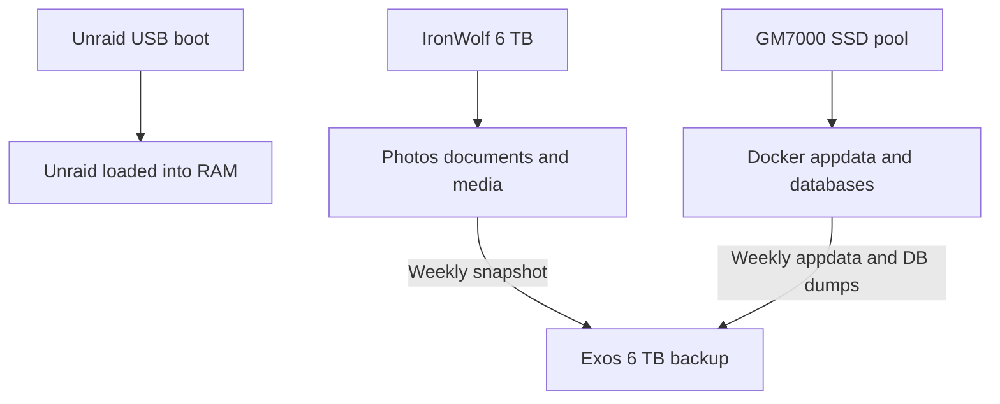
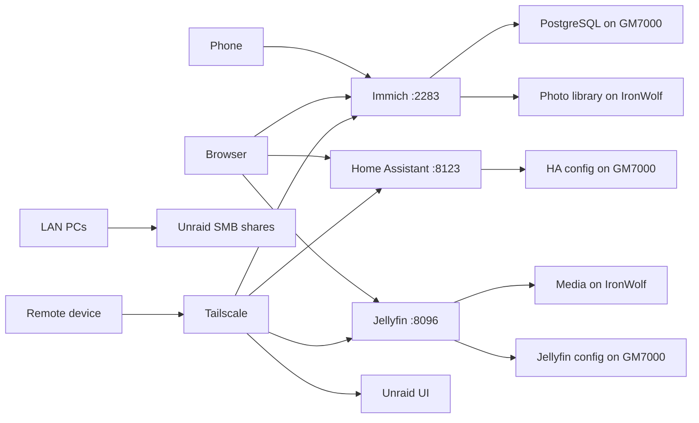
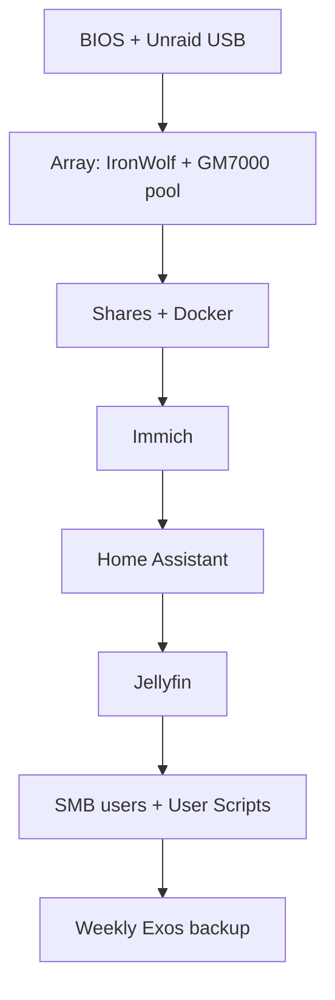

# Architecture Diagrams

## Storage

```mermaid
flowchart TD
    USB[Unraid USB boot] --> RAM[Unraid loaded into RAM]
    NVME[GM7000 SSD pool] --> APP[Docker appdata and databases]
    HDD[IronWolf 6 TB] --> DATA[Photos documents and media]
    DATA -->|Weekly snapshot| BK[Exos 6 TB backup]
    APP -->|Weekly appdata and DB dumps| BK
```

## Services

```mermaid
flowchart LR
    PHONE[Phone] --> IMMICH[Immich :2283]
    BROWSER[Browser] --> IMMICH
    BROWSER --> HA[Home Assistant :8123]
    BROWSER --> JF[Jellyfin :8096]
    LAN[LAN PCs] --> SMB[Unraid SMB shares]
    IMMICH --> PG[PostgreSQL on GM7000]
    IMMICH --> LIB[Photo library on IronWolf]
    JF --> MEDIA[Media on IronWolf]
    JF --> JFC[Jellyfin config on GM7000]
    HA --> CFG[HA config on GM7000]
    REMOTE[Remote device] --> TS[Tailscale]
    TS --> IMMICH
    TS --> HA
    TS --> JF
    TS --> UNRAID[Unraid UI]
```

## Bring-up order

```mermaid
flowchart TD
    A[BIOS + Unraid USB] --> B[Array: IronWolf + GM7000 pool]
    B --> C[Shares + Docker]
    C --> D[Immich]
    D --> E[Home Assistant]
    E --> F[Jellyfin]
    F --> G[SMB users + User Scripts]
    G --> H[Weekly Exos backup]
```
