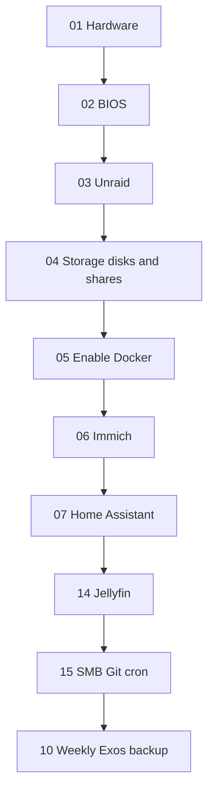
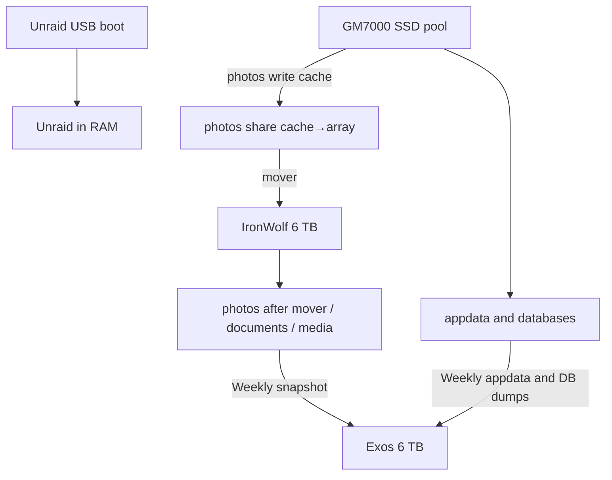
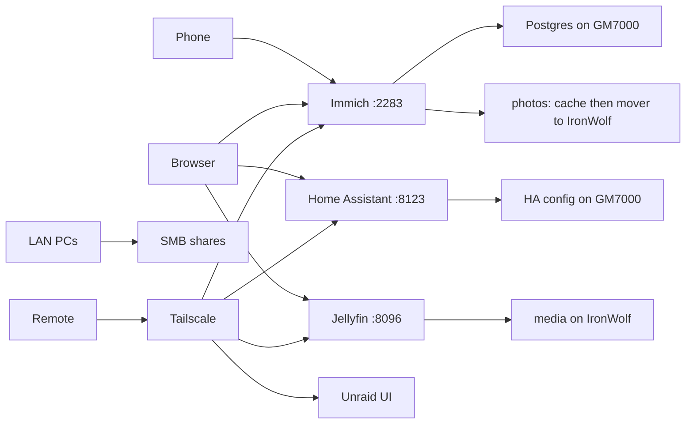

# Architecture Diagrams

## Setup order (follow this)

```mermaid
flowchart TD
    A[01 Hardware] --> B[02 BIOS]
    B --> C[03 Unraid]
    C --> D[04 Storage disks and shares]
    D --> E[05 Enable Docker]
    E --> F[06 Immich]
    F --> G[07 Home Assistant]
    G --> H[14 Jellyfin]
    H --> I[15 SMB Git cron]
    I --> J[10 Weekly Exos backup]
```

## Storage roles

```mermaid
flowchart TD
    USB[Unraid USB boot] --> RAM[Unraid in RAM]
    NVME[GM7000 SSD pool] --> APP[appdata and databases]
    HDD[IronWolf 6 TB] --> DATA[photos after mover / documents / media]
    NVME -->|photos write cache| PHOTOS[photos share cache→array]
    PHOTOS -->|mover| HDD
    DATA -->|Weekly snapshot| BK[Exos 6 TB]
    APP -->|Weekly appdata and DB dumps| BK
```

## Running services

```mermaid
flowchart LR
    PHONE[Phone] --> IMMICH[Immich :2283]
    BROWSER[Browser] --> IMMICH
    BROWSER --> HA[Home Assistant :8123]
    BROWSER --> JF[Jellyfin :8096]
    LAN[LAN PCs] --> SMB[SMB shares]
    IMMICH --> PG[Postgres on GM7000]
    IMMICH --> LIB[photos: cache then mover to IronWolf]
    JF --> MEDIA[media on IronWolf]
    HA --> CFG[HA config on GM7000]
    REMOTE[Remote] --> TS[Tailscale]
    TS --> IMMICH
    TS --> HA
    TS --> JF
    TS --> UNRAID[Unraid UI]
```
